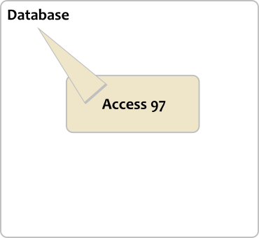
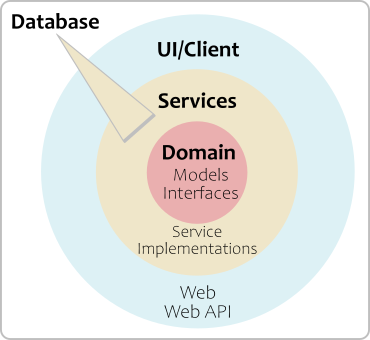
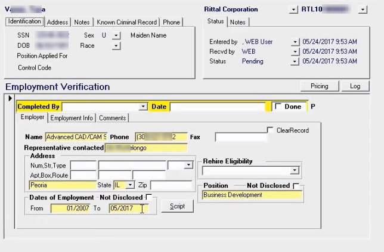
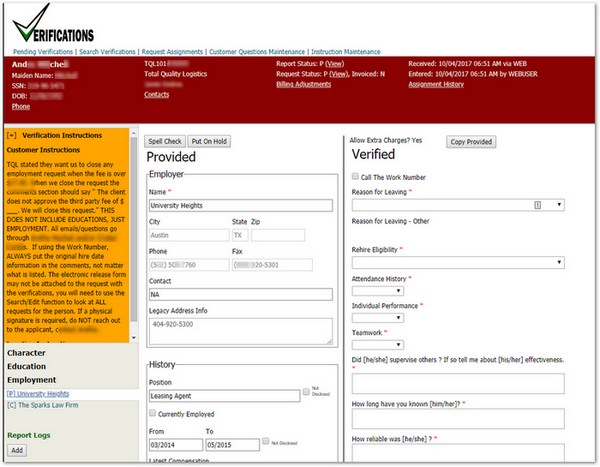

# Migrating Background Check Verifications From Access 97 to ASP.NET MVC

From This                    | To This
-----------------------------|----------------------------
 |&nbsp;&nbsp; 

---

# Architecture

Clean Architecture ("onion")
*   **Domain** (Request, Report, Verifier)
*   **Service Interfaces** (IVerificationsService)
*   **ORM** (Repository and Unit of Work)
*   **Services** (VerificationsService)
*   **WebApi** (/verifications/requests)(/verifications/reports)
    *   Security
    *   Unit Testing
*   **Web**
    *   Security

---

# Servers and Frameworks
*   SQL Server
*   IIS Server
*   C# Language
*   POCO for Domain classes
*   Entity Framework 6 (no patterns on top due to prior work)
*   Services implement interfaces and talk to database via EF
*   NancyFx injects services via interfaces, using Ninject.
    *   Legacy Membership Provider for Roles, but Active Directory authentication
    *   MS Test (I prefer xUnit.net)
*   ASP.NET MVC for routing, AngularJS for UI.
    *   Legacy Membership Provider for Roles, but Active Directory authentication

**And...**  
*   TFS 2015 for:
    *   Kanban board
    *   User stories/bug reports
    *   Source control (TFVC, not Git)
    *   Continuous Integration, and Deployment. I configured all of this,
    including Agent installation.

---

# Object Structure

*   Domain POCO classes *mostly* modeled database. No behavior.
*   Domain service interfaces: state and behavior.
*   Entity Framework "Code Second".
    *   Modeled existing database
    *   Renamed classes/properties for clarity and consistency.
    *   Only modeled needed properties.
    *   No "repository on top of repository"
*   Services directly used EF (not truly injected).
*   NancyFx. 
    *   Excellent choice. "Felt good" to use, and well-designed.
    *   Service interfaces injected, so lots of unit testing here.
    *   Returned ViewModels.
*   ASP.NET MVC with AngularJS
    *   Organized according to John Papa's Style Guide.
    *   Limited libraries as much as possible.
    *   Didn't use Bootstrap.
    *   Limited CSS as much as possible.
    *   Light CSS and assets isn't as pretty, but fast.

---

# Code Snippets

**Simple POCO Domain Class**  

```csharp
    public class ReportHoldLog
    {
        public int ReportHoldLogId { get; set; }
        public string ReportId { get; set; }
        public int? FastraxLogId { get; set; }
        public int? EmployeeId { get; set; }
        public bool OnHold { get; set; }
        public DateTime CreatedOn { get; set; }

        //Navigation
        public Report Report { get; set; }
        public FastraxLog FastraxLog { get; set; }
        public Employee Employee { get; set; }
    }
```

---

# Code Snippets

**Domain Class with Limited Behavior**  

```csharp
    public class Report
    {
        ----<snip>----
        
        /// <summary>
        ///  Finds the related header's OnHold status, returns false if not found
        /// </summary>
        /// <returns></returns>
        public bool OnHold()
        {
            bool? result = CharacterReport?.OnHold | EducationReport?.OnHold | EmploymentReport?.OnHold;
            return result.HasValue ? result.Value : false;
        }

        /// <summary>
        /// Returns true if Completed OR Status=C
        /// </summary>
        /// <returns></returns>
        public bool IsCompleted()
        {
            return Completed || Status == "C";
        }
        
        ----<snip>----
    }
```

---

# Code Snippets

**Service Interface**  

```csharp
    public interface IVerificationService
    {
        List<Request> GetPendingVerificationRequests();
        List<int> GetWorkNumberReportIds(int[] reportAlternateIds);
        List<Request> SearchVerificationRequests(RequestSearchFilter filter);
        Request GetRequest(int requestAlternateId, params Expression<Func<Request, object>>[] navigationProperties);
        void SaveCharacterReport(CharacterReport characterReport);
        
        ----<snip>----
    }

```

---

# Code Snippets

**DbContext**  

```csharp
    public class FastraxDb : DbContext
    {
        public DbSet<BillTransaction> BillTransactions { get; set; }
        public DbSet<CharacterReport> CharacterReports { get; set; }
        public DbSet<CharacterReportCustomerQuestionTemplate> CharacterReportCustomerQuestionTemplates { get; set; }
        
        ----<snip>----

        protected override void OnModelCreating(DbModelBuilder modelBuilder)
        {
            modelBuilder.Configurations.Add(new BillTransactionConfiguration());
            modelBuilder.Configurations.Add(new CharacterReportConfiguration());
            modelBuilder.Configurations.Add(new CharacterReportCustomerQuestionTemplateConfiguration());
            ----<snip>----
        }
  }
```

---

# Code Snippets

**EntityTypeConfiguration called from OnModelCreating**  

```csharp
    public class ReportConfiguration : EntityTypeConfiguration<Report>
    {
        public ReportConfiguration()
        {
            ToTable("tblReportsRequested").HasKey(x => x.ReportId);
            Property(p => p.ReportId).HasColumnName("RecordID");
            Property(p => p.ReportAlternateId).HasColumnName("ID")
                .HasDatabaseGeneratedOption(System.ComponentModel.DataAnnotations.Schema.DatabaseGeneratedOption.Identity);
            Property(p => p.RequestId).HasColumnName("RequestID");
            Property(p => p.RiskFactor).HasColumnName("Rating");

            Ignore(p => p.SearchAmericaReport);

            //Navigation
            HasRequired(prin => prin.Request);
            HasMany(dep => dep.FastraxLogs);
            HasMany(dep => dep.ReportHoldLogs);
            HasMany(dep => dep.SourceDatas);
        }
    }
```

---

# Code Snippets

**Service**  

```csharp
   public class VerificationService : IVerificationService
    {
        private static ILoggingService _log = null;
        private IRecordUtilitiesService _recordUtilitiesService = null;
        private FastraxDb _db = null;

        private string[] _canceledRequestStatuses = { "R", "X" };
        //private string[] _pendingReportStatuses = { "I", "P", "X" };
        private int[] _userReportTypes = { 1, 3 };
        private int[] _verificationReportPackageIds = { 12, 14, 21 };
        private int _releaseFormPackage = 5000;


        public VerificationService(ILoggingService log, IRecordUtilitiesService recordUtilitiesService, FastraxDb db) : base()
        {
            _log = log;
            _recordUtilitiesService = recordUtilitiesService;
            _db = db;
        }
```

---

# Code Snippets

**Some Sophisticated LINQ**  

```csharp
        public List<Request> GetPendingVerificationRequests()
        {
            //This ONLY returns pending reports, which at the moment is OK
            //because the Pending list doesn't care about completed report counts in a request.
            //See the Search query for including completed, which is a lot slower.
            var requests =
                (from q in _db.Reports
                        .Include(a => a.CharacterReport)
                        .Include(a => a.EducationReport)
                        .Include(a => a.EmploymentReport)
                        .Include(a => a.Request.CustomerLocation.Customer)
                        .Include(a => a.Request.RequestAssignments.Select(b => b.Employee))
                 where (q.Completed == false & q.Status != "C")
                            & (q.CharacterReport != null
                            | q.EducationReport != null
                            | q.EmploymentReport != null)
                 & !_canceledRequestStatuses.Contains(q.Request.Status)
                 & !q.Request.CustomerId.Equals("UCT103")
                 & !q.Request.Invoiced
                 & _verificationReportPackageIds.Contains(q.PackageBaseId)
                 & _userReportTypes.Contains(q.ReportType)
                 select q)
                    //materialize the reports with their related entities using ToList()
                    .ToList()
                    //get the requests
                    .Select(a => a.Request)
                    .Distinct()
                    .ToList();
            ----<snip>----
```

---

# Code Snippets

**NancyFx**  
Note the helper method `JsonResponseFrom()`.

```csharp
        public Verifications(IVerificationService verificationService, IEmployeeService employeeService,
            IRequestAssignmentService requestAssignmentService, IFastraxLogService logService, base("/verifications")
        {
            _verificationService = verificationService;
            this.RequiresAuthentication();

            Get["/pending"] = _ => JsonResponseFrom(() => GetPending());
            Get["/search"] = _ => JsonResponseFrom(() => GetRequestSearch());
            Get["/request/{id}"] = _ => JsonResponseFrom(() => GetRequest(_.id));
            Get["/character/report/{id}"] = _ => JsonResponseFrom(() => GetCharacterReport(_.id));
            Post["/character/report"] = _ => JsonResponseFrom(() => PostCharacterReport(), "Unable to save:");
            
            ----<snip>----
            
        protected List<VerificationRequestSummaryModel> GetPending()
        {
            var list = new List<VerificationRequestSummaryModel>();
            var pendingRequests = _verificationService.GetPendingVerificationRequests();
            list = GetSummaries(pendingRequests);
            return list;
        }
```

---

# Code Snippets

**Typical Unit Test**  

```csharp
    [TestClass]
    public class Get_EmploymentReport_Should : VerificationsTests
    {
        ----<snip>----
    
        [TestMethod]
        [TestCategory("Verifications Test")]
        public void Return_expected_error_message()
        {
            //Using .ThrowError = true will get caught when getting the record
            //and return as "record not found."
            //Use a record that will fail during mapping.
            _verificationService.EmploymentReports = EmploymentReports.OnePendingReport;
            _verificationService.EmploymentReports[0].Report = null;
            var response = GetResponse(ReplaceId(_path, 1));
            string body = GetDeserializedResponseBody<string>(response);
            Assert.AreEqual(HttpStatusCode.BadRequest, response.StatusCode);
            Assert.AreEqual("Object reference not set to an instance of an object.", body);
        }
```

---

# Code Snippets

**Some AngularJS**  

```javascript
(function () {
  'use strict';

  angular
    .module('verifications')
    .controller('VerificationsEdit', VerificationsEdit);

  VerificationsEdit.$inject = ['verificationsService', '$timeout', '$templateCache', '$scope', 'auth', 'focus'];
  function VerificationsEdit(verificationsService, $timeout, $templateCache, $scope, auth, focus) {
    //Initialize the message directive object
    $scope.msgObject = {};

    var vm = this;
    vm.request = {};
    vm.pristineRequest = {};
    ----<snip>----
    function getRequestVerifications(id) {
      $scope.msgObject.showWaiting();
      verificationsService.getRequestVerifications(id)
        .then(function (response) {
          setRequest(response.data);
          $scope.msgObject.hideWaiting();
        }, function (error) {
          $scope.msgObject.hideWaiting();
          $scope.msgObject.showError(error.data);
        });
    }
```

---

# Code Snippets

**Some CSS**  

```css
/*https://www.inserthtml.com/2012/06/custom-form-radio-checkbox/*/

.verifications input[type=checkbox] {
    -webkit-appearance: none;
    background-color: white;
    border: 1px solid #005E7B;
    /*box-shadow: 0 1px 2px rgba(0,0,0,0.05), inset 0px -15px 10px -12px rgba(0,0,0,0.05);*/
    padding: 9px;
    border-radius: 3px;
    display: inline-block;
    position: relative;
}

    .verifications input[type=checkbox]:active, input[type=checkbox]:checked:active {
        /*box-shadow: 0 1px 2px rgba(0,0,0,0.05), inset 0px 1px 3px rgba(0,0,0,0.1);*/
    }

    .verifications input[type=checkbox]:checked:after {
        content: '\2714';
        font-size: 14px;
        position: absolute;
        top: 0px;
        left: 3px;
        color: #005e7b;
    }
```

---

# Database Access
Challenges included:  
*   Matching Access 97 queries and updates.
*   Avoiding SQL trigger problems.
*   Adding DB missing relational integrity into EF.
*   Staying close to existing EF work, but diverging for clarity.

---

# Design Considerations and Tradeoffs
> I'm not a designer, but I'm good at usability.

*   I originally pitched a Kanban board approach as the final result.
*   Layed out the UI to match the business flow.
*   Kept hands on keys as much as possible.
*   The site was intended to be integrated into the
    "main" site, so I designed with idea my HTML/CSS would be reworked.
*   Looked more like Craigslist than Gmail, BUT
*   Efficacy mattered more than aesthetics

---

# The Old Look


---

# The New Look



---

# Challenges
*   Fear (of change)
    *   Listen and understand.
    *   Involve them via user stories.
    *   Make changes based on their input.
    *   Trust them and their strengths.
*   Limited help from the lead developer
    *   He was thinking of this being a 
"microservice." I never told him it clearly couldn't be.
    *   Asked for and never received code reviews.
    *   Kept CIO informed, to limit any blowback.
*   Using Git locally, and pushing to TFS. This became even 
    harder when their VPN changed, but significantly improved
    my productivity.

---

# Time Machine
*   Make my EF changes early. (However, making them later proved the code's maintainability)
*   Less time on Kanban prototype. (However, this was great for business rule discovery.)
